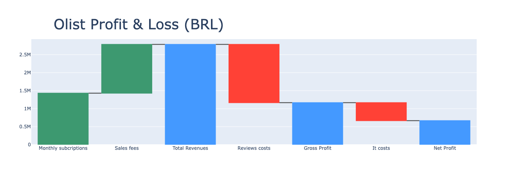

# Olist Data Analysis 🇧🇷

## 📊 Project Overview
This project performs a comprehensive analysis of **Olist**, a leading Brazilian e-commerce marketplace integrator, to find data-driven strategies for profitability.

It also serves as a hands-on exercise to strengthen data analysis and visualization skills through data preparation, exploratory analysis, and business modeling.

The primary goal is to answer the CEO's directive:
  **"How can Olist increase its profit?"**
  **How many sellers need to be removed to optimize profit**

## 🎯 Objectives
- **Profit Optimization**: Determine the optimal number of sellers to maintain on the platform.
- **Seller Quality Analysis**: Investigate the impact of underperforming sellers on reputation and costs.
- **P&L Modelling**: Construct a Profit & Loss model incorporating revenues (commissions, fees) and costs (IT infrastructure, reputation damage).
- **Data Analysis & Visualization Practice**: Strengthen skills in data cleaning, preparation, exploratory data analysis (EDA), and visual storytelling through hands-on work with real e-commerce data.

## 📂 Project Structure
├── notebooks
│   ├── CEO_request.ipynb          # ⭐️ Complete P&L optimization & recommendations
│   ├── data_preparation.ipynb     # Data cleaning & preprocessing
│   ├── exploratory_analysis.ipynb # Initial EDA & visualization
│   ├── orders.ipynb               # Orders-level analysis
│   └── sellers.ipynb              # Seller-level analysis
├── OlistClass
│   ├── __init__.py
│   ├── data.py          # Data ingestion and cleaning
│   ├── order.py         # Order entity logic
│   ├── product.py       # Product entity logic
│   ├── README.md        # Project documentation
│   ├── review.py        # Review entity logic
│   ├── seller.py        # Seller entity logic
│   └── utils.py         # Helper functions (stats, plotting)
├── OlistData
│   └── data
│       ├── csv
│       │   ├── olist_customers_dataset.csv
│       │   ├── olist_geolocation_dataset.csv
│       │   ├── olist_order_items_dataset.csv
│       │   ├── olist_order_payments_dataset.csv
│       │   ├── olist_order_reviews_dataset.csv
│       │   ├── olist_orders_dataset.csv
│       │   ├── olist_products_dataset.csv
│       │   ├── olist_sellers_dataset.csv
│       │   └── product_category_name_translation.csv
│       └── olist.zip
├── Olist_data_schema.png
├── Olist_profit_loss.png            # Profit & Loss visualization
├── Olist_schema_v2.png
├── README.md                        # Project documentation
├── Repartition_of_olist_profit.png  # Profit distribution visualization
├── Results
└── requirements.txt                 # Project prerequisites

## 🚀 Getting Started
### Prerequisites
The project requires **Python 3.x** and the following libraries:
- `pandas`
- `numpy`
- `matplotlib`
- `seaborn`
- `statsmodels`

### Installation & Setup

1. **Install Dependencies**:
   ```bash
   pip install -r requirements.txt
   ```

2. **Configure Data Path**:
   ⚠️ **Note**: The data loading path is currently hardcoded for the local environment.
   Open `olistClass/data.py` and modify the `csv_path` variable in the `get_data` method to point to your local `olistData/data/csv` directory.

### Running the Analysis
1. Start specific component analyzes in `notebooks/orders.ipynb` or `notebooks/sellers.ipynb` to understand the data.
2. Run **`notebooks/CEO_request.ipynb`** for the complete P&L optimization analysis and final recommendations.

## 📈 Methodology: The P&L Model

To determine profitability, we modeled the P&L as follows:

- **💰 Revenues**:
  - **10%** commission on product sales.
  - **80 BRL** monthly subscription fee per seller.

- **💸 Costs**:
  - **IT Costs**: Modeled as scaling with the square root of the number of sellers and items sold (reflecting scale efficiency).
  - **Reputation Costs**: Estimated monetary loss associated with bad reviews (e.g., 1-star review = high cost due to churn/support).

- **Strategy**:
  We simulate the removal of sellers starting from the least profitable (highest negative impact due to reviews/low volume) to find the global profit maximum.

## Key Insights
- **Wait time** is the strongest predictor of customer dissatisfaction (low review scores).
- A significant portion of sellers generates more cost (reputation damage + IT overhead) than revenue.
- **Optimization**: By removing the identified underperforming sellers, Olist can potentially increase its net profit while reducing operational complexity.

---
*Based on the Olist E-commerce Public Dataset.*

## 🗄️ Data Schema


## 📊 Visualizations



